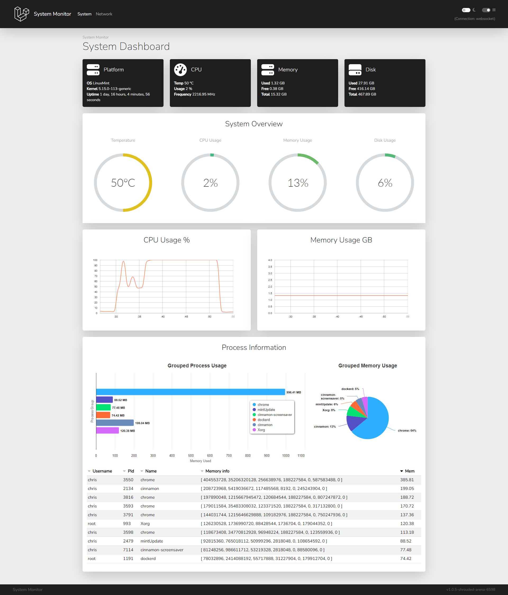

# System Monitor

A lightweight monitoring dashboard for your server.

View a [live example here](https://status.versyx.net).

## Quick Start

### Requirements

- [psmonitor](https://github.com/sentrychris/psmonitor): You can choose between either the standalone server or the full application, both of them contain the remote monitoring component. You can download a ready-made executable from the [Releases section](https://github.com/sentrychris/psmonitor/releases/tag/v1.2.2.1551).

### Setup

Before you setup this project, you'll need to setup [psmonitor](https://github.com/sentrychris/psutil-websocket-monitor) to provide the data that the dashboard will request and display.

After downloading and running psmonitor, proceed with the setup.

1. Clone the repository
    ```
    git clone git@github.com:sentrychris/system-monitor.git
    ```

2. Install dependencies
    ```
    npm install
    ```

3. Copy `.env.example` to `.env` and configure your environment variables
    ```
    VITE_APP_NAME="System Monitor"                        # Visible in the navbar, page headers and the footer

    VITE_API_URL="http://192.168.1.237:4500"              # The URL for the psutil-websocket-monitor server
    VITE_WORKER_URL="http://192.168.1.237:4500"           # The URL for the psutil-websocket-monitor endpoint for fetching a worker
    VITE_WEBSOCKET_URL="ws://192.168.1.237:4500/connect"  # The URL for the psutil-websocket-monitor endpoint for connecting via websocket
    VITE_CONNECTION_TYPE="websocket"                      # "http" for static data, "websocket" for live data
    ```

The application is designed to work with either static data served from standard HTTP endpoints, or live data served through websocket connections.

- If you set `VITE_CONNECTION_TYPE` to `websocket`, the dashboard will load with a websocket connection configured and will display live data that updates in real time.
- If you set `VITE_CONNECTION_TYPE` to `http`, the dashboard will load with data requested from an HTTP endpoint and will poll for updates every 30 seconds.

There is a control switch provided at the top-right on the navbar to toggle the connection type between HTTP and Websocket.

I hope you find this project useful, if you have any questions or feedback, please feel free to raise an [issue here](https://github.com/sentrychris/system-monitor/issues).

---

## Screenshot



## License
This software is open-sourced software licensed under the MIT license.
