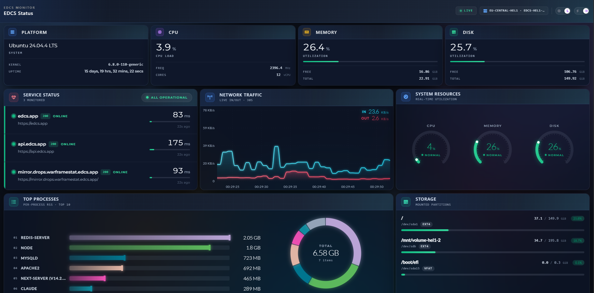

# System Monitor

A lightweight monitoring dashboard for your server.

View a [live example here](https://status.versyx.net).

## Dashboard

The dashboard renders four rows on a single screen:

- **Stats row** — Platform, CPU, Memory, Disk summary cards.
- **Status row** — Service Status (probes pulled from `/probes`, with online/slow/offline classification and latency bars), live Network Traffic chart (in/out bytes/sec from `/system.network`, auto-scaling Y axis with smoothed transitions), and a compact System Resources gauge stack.
- **Processes + Storage** — top-10 process bar + pie (live RSS/PSS aggregation), plus a per-partition Storage list with gradient usage bars.
- **Live time-series** (when in WebSocket mode) — CPU and Memory line charts.

The container-query-based components scale cleanly between full-width and narrow-card placements, so widgets stay readable on mobile and dense on desktop without scrolling.

## Quick Start

### Requirements

- [psmonitor](https://github.com/sentrychris/psmonitor): You can choose between either the standalone server or the full application, both of them contain the remote monitoring component. You can download a ready-made executable from the [Releases section](https://github.com/sentrychris/psmonitor/releases/tag/v1.2.2.1551).

### Setup

Before you setup this project, you'll need to setup [psmonitor](https://github.com/sentrychris/psutil-websocket-monitor) to provide the data that the dashboard will request and display.

After downloading and running psmonitor, proceed with the setup.

1. Clone the repository

   ```
   git clone git@github.com:sentrychris/system-monitor.git
   ```

2. Install dependencies

   ```
   npm install
   ```

3. Copy `.env.example` to `.env` and configure your environment variables

   ```
   VITE_APP_NAME="System Monitor"                        # Visible in the navbar, above page heading and the footer
   VITE_APP_TITLE="Versyx Status"                        # Page title, visible as the page heading

   VITE_APP_DEPLOY_REGION=us-central1-a                  # (optional) visible in the footer
   VITE_APP_DEPLOY_INSTANCE=versyxweb1                   # (optional) visible in the footer

   VITE_API_URL="http://192.168.1.237:4500"              # The URL for the psutil-websocket-monitor server
   VITE_WORKER_URL="http://192.168.1.237:4500"           # The URL for the psutil-websocket-monitor endpoint for fetching a worker
   VITE_WEBSOCKET_URL="ws://192.168.1.237:4500/connect"  # The URL for the psutil-websocket-monitor endpoint for connecting via websocket
   VITE_CONNECTION_TYPE="websocket"                      # "http" for static data, "websocket" for live data
   ```

The application is designed to work with either static data served from standard HTTP endpoints, or live data served through websocket connections.

- If you set `VITE_CONNECTION_TYPE` to `websocket`, the dashboard will load with a websocket connection configured and will display live data that updates in real time.
- If you set `VITE_CONNECTION_TYPE` to `http`, the dashboard will load with data requested from an HTTP endpoint and will poll for updates every 30 seconds.

There is a control switch provided at the top-right on the navbar to toggle the connection type between HTTP and Websocket.

The dashboard consumes three endpoints from psmonitor: `GET /system` (single-fetch snapshot — also drives the `/connect` WebSocket stream), `GET /network` (interface counters and Wi-Fi info), and `GET /probes` (configurable external service health checks). Multi-disk and live network throughput data are populated by the `disks` and `network` fields on `/system`.

I hope you find this project useful, if you have any questions or feedback, please feel free to raise an [issue here](https://github.com/sentrychris/system-monitor/issues).

---

## Screenshot



## License

This software is open-sourced software licensed under the MIT license.
