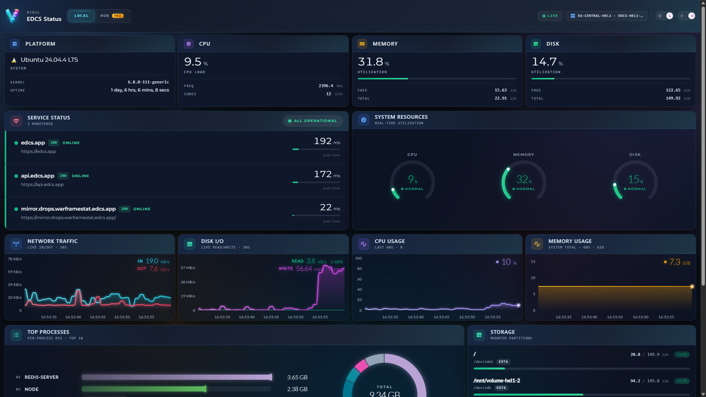

<p align="center">
  
</p>

<h1 align="center">Vigil</h1>

<p align="center">A lightweight monitoring dashboard for one server, or a fleet of them.</p>

<p align="center">View a <a href="https://status.edcs.app">live example here</a>.</p>



Vigil ships in **two modes** that share the same SPA build:

- **Local** — connects directly to one [vigil-collector](https://github.com/sentrychris/vigil-collector)
  via HTTP/WebSocket and shows that host's full live dashboard. The
  original mode; what most operators want for a single box.
- **Hub** — connects to a [Vigil Pro](https://github.com/sentrychris/vigil-pro)
  Hub and surfaces a fleet view, per-host detail with sparkline metrics,
  the alert state machine, and rule management. Enabled by setting
  `VITE_HUB_URL` at build time. Optional.

Both modes coexist in one build; the navbar carries a `Local | Hub`
segmented switcher when Hub mode is enabled.

## Quick Start

### Requirements

- [vigil-collector](https://github.com/sentrychris/vigil-collector) — the agent that gathers system samples.
- [vigil-pro](https://github.com/sentrychris/vigil-pro) (optional) — the multi-host hub. Only needed for Hub mode.

1. Clone the repository

   ```
   git clone git@github.com:sentrychris/vigil.git
   ```

2. Install dependencies

   ```
   npm install
   ```

3. Copy `.env.example` to `.env` and configure your environment variables

   ```
   VITE_APP_NAME="Vigil"                                 # Visible in the navbar, above page title
   VITE_APP_TITLE="Metric & Monitoring"                  # Visible in the navbar, page title

   VITE_APP_DEPLOY_REGION=us-central1-a                  # (optional) visible in the footer
   VITE_APP_DEPLOY_INSTANCE=chris-web1                   # (optional) visible in the footer

   # ─── Local mode ───────────────────────────────────────────────────
   VITE_API_URL="http://192.168.1.237:4500"              # vigil-collector base URL
   VITE_WORKER_URL="http://192.168.1.237:4500/worker"    # collector's worker endpoint
   VITE_WEBSOCKET_URL="ws://192.168.1.237:4500/connect"  # collector's websocket endpoint
   VITE_CONNECTION_TYPE="websocket"                      # "http" for static data, "websocket" for live

   # ─── Hub mode (optional) ──────────────────────────────────────────
   VITE_HUB_URL="https://hub.vigil.example.com"          # Vigil Pro Hub base URL
   ```

## Local mode

The dashboard at `/` works with either static data served from standard HTTP endpoints, or live data served through websocket connections.

- If you set `VITE_CONNECTION_TYPE` to `websocket`, the dashboard will load with a websocket connection configured and will display live data that updates in real time.

- If you set `VITE_CONNECTION_TYPE` to `http`, the dashboard will load with data requested from an HTTP endpoint and will poll for updates every 30 seconds.

There is a control switch provided at the top-right on the navbar to toggle the connection type between HTTP and Websocket.

## Hub mode

Setting `VITE_HUB_URL` at build time enables the hub routes. Everything
behind them is gated by the Vigil Pro admin bearer token — paste it
once on first visit and it's stored in `localStorage` for that browser.

| Path | What |
|---|---|
| `/hub`              | Fleet overview — host list, fleet alert state, recent activity, ops command popout |
| `/hub/hosts/<id>`   | Host detail — system data sheet, health card, sparkline metrics, source footnote |
| `/hub/rules`        | Alert rules — list, drill into rule definitions, inline delete |
| `/hub/help`         | Alert state-machine docs (firing / breaching / OK + transitions + edge cases) |

The host-detail page renders an "Open dashboard" link when the host's
`collector_url` is set on the hub, deep-linking to that host's own
collector dashboard for full live metrics. See the Vigil Pro
[FLEET.md](https://github.com/sentrychris/vigil-pro/blob/main/FLEET.md)
for the reverse-proxy pattern that makes those URLs reachable.

When Hub mode isn't configured, the navbar hides the segmented switcher
and the routes render a "Hub mode disabled" notice.

## Theme

Vigil is dark-first per its design language ([branding spec](https://vigil.edcs.app/branding.html)).
The theme toggle lives in the navbar; the choice persists in
`localStorage`. New visitors default to dark.

## Feedback

I hope you find this project useful, if you have any questions or feedback, please feel free to raise an [issue here](https://github.com/sentrychris/vigil/issues).

## License

MIT.
